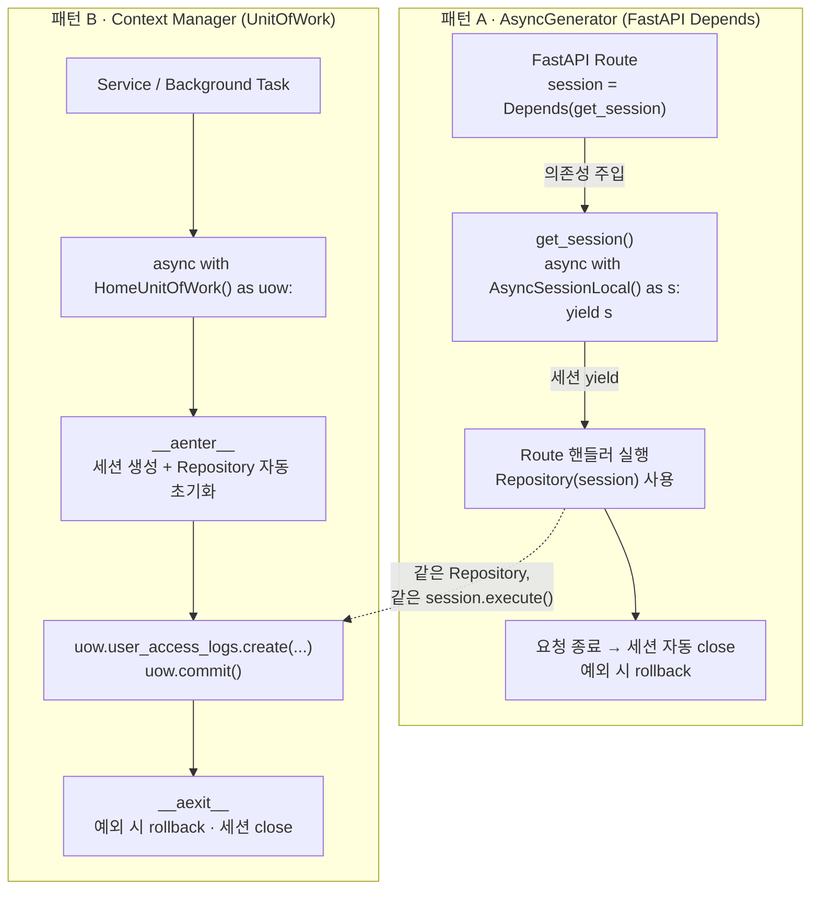
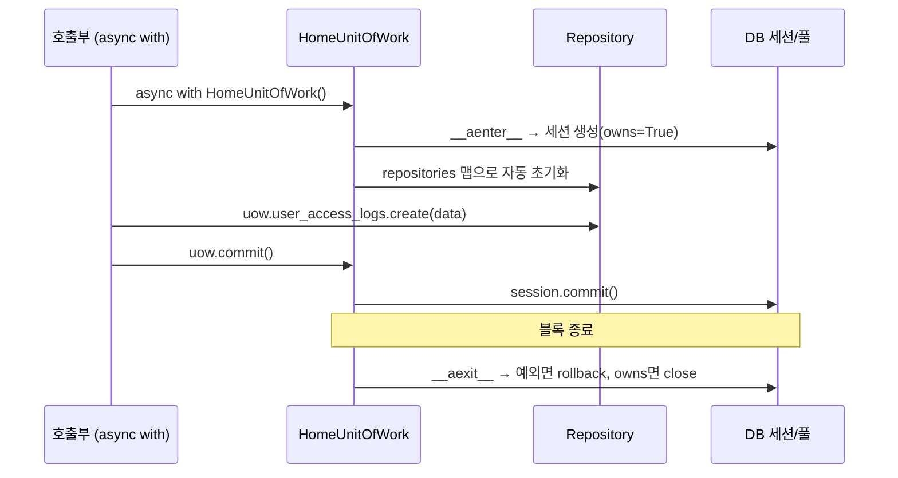
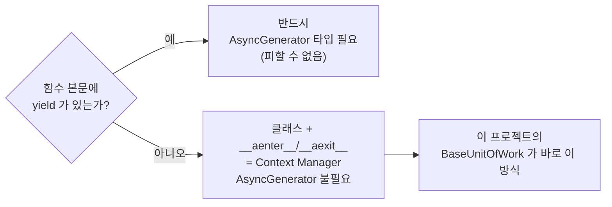
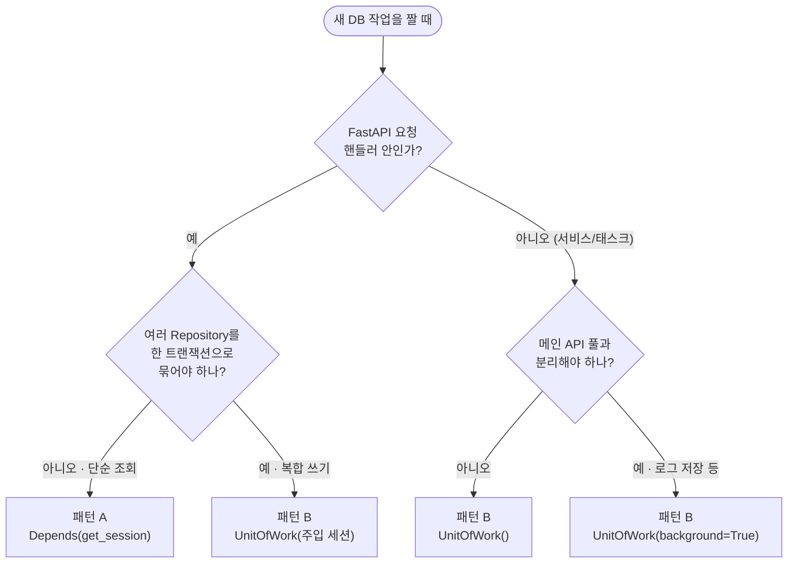

# 세션 관리 패턴 — AsyncGenerator vs Context Manager(UnitOfWork)

> **분류:** 개념/기술 심화 (concept) · **작성일:** 2026-06-23
> **연관 코드:** [`app/core/db/session.py`](../../app/core/db/session.py) · [`app/core/db/unit_of_work.py`](../../app/core/db/unit_of_work.py)
> **상위 문서:** [아키텍처 문서](../ARCHITECTURE.md)

이 문서는 본 프로젝트가 **데이터베이스 세션을 어떻게 열고·쓰고·닫는가**를 다룹니다.
같은 목적(세션 수명 관리)을 이루는 두 가지 파이썬 메커니즘 —
**`AsyncGenerator`(yield)** 와 **비동기 컨텍스트 매니저(`__aenter__`/`__aexit__`)** —
를 비교하고, 각각을 언제 쓰는지, 그리고 둘이 어떻게 같은 Repository를 공유하는지 설명합니다.

> 📌 **읽는 법** — 처음이라면 1·2장(왜 세션 관리가 문제인가, 두 그림)만 읽어도 됩니다.
> 코드를 만지는 중이라면 6장(의사결정 표)과 7장(권장 패턴)으로 바로 가세요.

---

## 1. 먼저, 왜 "세션 관리"가 따로 다뤄질 만큼 중요한가

데이터베이스 세션(`AsyncSession`)은 **빌린 자원**입니다. 커넥션 풀에서 연결 하나를
빌려와 작업하고, 끝나면 **반드시 돌려줘야** 합니다. 돌려주지 않으면(=세션을 닫지
않으면) 풀의 연결이 하나씩 줄어들고, 결국 풀이 고갈되어 모든 요청이 멈춥니다.

```
커넥션 풀 (pool_size=20, max_overflow=20  →  최대 40)
┌───────────────────────────────────────────────┐
│  ● ● ● ● ● ○ ○ ○ ○ ○ ○ ○ ○ ○ ○ ○ ○ ○ ○ ○      │   ● = 사용 중(빌려감)
└───────────────────────────────────────────────┘   ○ = 대기(반납됨)
       ▲ 빌리고 안 돌려주면 ● 가 계속 쌓여 → 고갈 → 장애
```

그래서 "세션을 빌렸으면 **무슨 일이 있어도**(예외가 나도) 닫는다"가 철칙입니다.
파이썬에는 이 *"열고 → 쓰고 → 반드시 닫고"* 를 자동으로 보장하는 두 가지 장치가
있고, 본 프로젝트는 상황에 따라 **둘 다** 사용합니다.

| 장치 | 핵심 문법 | 본 프로젝트에서의 역할 |
|------|-----------|------------------------|
| **AsyncGenerator** | `yield session` | FastAPI `Depends()` 의존성 주입 (요청 단위) |
| **Context Manager** | `async with UoW() as uow` | 서비스 로직 · 백그라운드 태스크 (명시적 트랜잭션) |

---

## 2. 두 패턴을 한 장의 그림으로



핵심은 **점선**입니다. 세션을 *어떻게 만들었는지*(yield냐 `async with`냐)와
무관하게, 그 안에서 일하는 **Repository는 완전히 동일**합니다. Repository는 세션을
주입받아 쓸 뿐, 세션의 출생 신고서를 보지 않습니다.

---

## 3. 패턴 A — AsyncGenerator (`get_session`)

### 3.1 코드 (실제: `session.py:133`)

```python
from typing import AsyncGenerator

async def get_session() -> AsyncGenerator[AsyncSession, None]:
    async with AsyncSessionLocal() as session:
        try:
            yield session          # ← yield 가 있으니 '비동기 제너레이터'
        except Exception as e:
            await session.rollback()
            raise e
        # async with 블록이 끝나며 세션 자동 close
```

### 3.2 왜 타입이 `AsyncGenerator[AsyncSession, None]` 인가

함수 본문에 `yield` 가 **하나라도** 있으면, 그 함수는 "값을 반환(`return`)하는
함수"가 아니라 **"값을 차례로 내보내는 제너레이터"** 가 됩니다. 비동기 함수에서
`yield` 를 쓰면 그 정체는 **`AsyncGenerator`** 이고, 타입 힌트도 그것을 따라야 합니다.

```
AsyncGenerator[ YieldType , SendType ]
                    │           └ 제너레이터로 .asend() 할 때 받는 타입 (안 쓰면 None)
                    └ yield 로 내보내는 값의 타입 = AsyncSession
```

> 💡 **한 줄 요약:** `yield` 를 쓰는 순간 `AsyncGenerator` 타입은 **선택이 아니라 필수**입니다.

### 3.3 FastAPI는 이 제너레이터를 어떻게 다루나

FastAPI의 `Depends(get_session)` 는 이 제너레이터를 *요청 수명에 묶어* 운전합니다.

```
요청 도착 ─▶ get_session() 시작 ─▶ yield 직전까지 실행(세션 생성)
                                        │
                                  yield 된 session 을 핸들러에 주입
                                        │
                              ┌─────────┴─────────┐
                       정상 종료              예외 발생
                              │                   │
            제너레이터 재개 → finally        except 블록 → rollback → 재전파
            (async with 종료 = close)        그 뒤 close
```

요청 1건 = 세션 1개 = 트랜잭션 경계 1개. **암묵적**이고 간결합니다.

```python
# router.py
@router.get("/logs")
async def get_logs(session: AsyncSession = Depends(get_session)):
    repo = UserAccessLogRepository(session)
    return await repo.get_recent_logs()
```

---

## 4. 패턴 B — Context Manager (`BaseUnitOfWork`)

### 4.1 코드 (실제: `unit_of_work.py:41`)

본 프로젝트의 `BaseUnitOfWork` 는 `flow.md` 초안보다 한 단계 더 진화해 있습니다.
**세션 주입/자동생성, 일반/백그라운드 풀, Repository 자동 초기화**를 한 클래스가
모두 담당합니다(과거의 `Background…UnitOfWork` 쌍둥이 클래스는 제거됨).

```python
class BaseUnitOfWork:
    repositories: dict[str, type] = {}        # 선언만 하면 자동 초기화

    def __init__(self, session: AsyncSession | None = None, *, background: bool = False):
        self._session = session
        self._owns_session = session is None  # 내가 만들었으면 내가 닫는다
        self._background = background          # 백그라운드 풀 사용 여부

    async def __aenter__(self) -> Self:
        if self._owns_session:                # 주입 안 받았으면 직접 생성
            factory = BackgroundSessionLocal if self._background else AsyncSessionLocal
            self._session = factory()
        for attr, repo_cls in self.repositories.items():  # Repository 자동 결선
            setattr(self, attr, repo_cls(self._session))
        return self

    async def __aexit__(self, exc_type, exc_val, exc_tb) -> None:
        if exc_type is not None:
            await self.rollback()             # 예외 시 자동 롤백
        if self._owns_session and self._session:
            await self._session.close()       # 내가 만든 세션만 내가 닫는다
```

도메인 하위 클래스는 **Repository 목록만 선언**하면 됩니다.

```python
# app/domains/home/unit_of_work.py
class HomeUnitOfWork(BaseUnitOfWork):
    user_access_logs: UserAccessLogRepository
    repositories = {"user_access_logs": UserAccessLogRepository}
```

### 4.2 `yield` 가 없으므로 `AsyncGenerator` 도 없다

패턴 B는 `yield` 를 한 번도 쓰지 않습니다. 대신 `__aenter__`(진입)와
`__aexit__`(종료) **매직 메서드**가 "열고/닫고"를 담당합니다. 따라서
`from typing import AsyncGenerator` import 자체가 **불필요**합니다.



### 4.3 사용 예

```python
# 서비스 / 백그라운드 태스크
async def save_access_log(data: dict):
    async with HomeUnitOfWork() as uow:        # 세션 자동 생성
        await uow.user_access_logs.create(data)
        await uow.commit()                     # 트랜잭션 경계가 '명시적'

# 백그라운드 전용 풀이 필요할 때 — 클래스 교체 없이 플래그만
async def save_in_background(data: dict):
    async with HomeUnitOfWork(background=True) as uow:
        await uow.user_access_logs.create(data)
        await uow.commit()
```

> 💡 **세션 소유권(ownership)** — UoW가 외부에서 세션을 *주입받으면*
> (`_owns_session=False`) 닫지 **않습니다**. FastAPI가 준 세션을 UoW가 멋대로
> 닫아버리는 사고를 막는 안전장치입니다. 이 덕분에 패턴 A의 세션을 패턴 B 안으로
> 그대로 넘겨 재사용할 수 있습니다: `async with HomeUnitOfWork(session) as uow:`.

---

## 5. Repository는 두 패턴 모두에 무관하다

```python
# user_access_log_repository.py
class UserAccessLogRepository(BaseRepository[UserAccessLog]):
    def __init__(self, session: AsyncSession) -> None:
        super().__init__(session)
    # 내부는 항상 self.session.execute(...) — 세션의 출신을 묻지 않는다
```

| 구분 | 패턴 A · AsyncGenerator | 패턴 B · UnitOfWork |
|------|-------------------------|---------------------|
| 세션 공급원 | `get_session()` 이 `yield` | `UoW.__aenter__` 가 생성/주입 |
| Repository 초기화 | 핸들러에서 직접 `Repo(session)` | `repositories` 맵이 자동 결선 |
| 세션 사용 | `self.session.execute()` | `self.session.execute()` (동일) |
| 트랜잭션 커밋 | 보통 암묵적/요청 단위 | `uow.commit()` 명시적 |

**Repository는 세션을 주입받아 쓸 뿐, 어떻게 태어났는지 알 필요가 없다** — 이것이
두 패턴이 충돌 없이 공존하는 비결입니다.

---

## 6. "AsyncGenerator를 안 쓰면?" — 가능/불가능 정리



- `yield` 를 쓰는 한 `AsyncGenerator` 는 **회피 불가**. (둘은 한 몸)
- `AsyncGenerator` 를 정말 쓰기 싫다면 → **클래스 기반 컨텍스트 매니저**로 전환.
- 본 프로젝트엔 이미 그 전환의 결과물(`BaseUnitOfWork`)이 존재. 즉 **둘 다 보유**한 상태가 의도된 설계입니다.

### 두 패턴 비교 요약

| 항목 | AsyncGenerator (`yield`) | Context Manager (UnitOfWork) |
|------|--------------------------|------------------------------|
| 타입 import | `from typing import AsyncGenerator` | 불필요 |
| 세션 생성 | `yield session` | `factory()` (또는 주입) |
| FastAPI `Depends` | 직접 지원 | 직접은 불가 (래퍼/주입 필요) |
| 트랜잭션 경계 | 요청 단위(암묵적) | `commit()` 명시 호출 |
| 다중 Repository | 각각 따로 주입 | UoW가 한 번에 통합 결선 |
| 백그라운드 풀 | `get_background_session()` | `UnitOfWork(background=True)` |
| 세션 소유권 제어 | 없음(항상 자기 것) | `_owns_session` 으로 정밀 제어 |

---

## 7. 권장 사용 패턴 (의사결정 가이드)



| 시나리오 | 권장 | 이유 |
|----------|------|------|
| 단순 조회 API | 패턴 A (`Depends(get_session)`) | 간결, FastAPI와 자연 통합 |
| 복합 비즈니스 로직(다중 Repo·명시 트랜잭션) | 패턴 B `UnitOfWork()` | 트랜잭션 경계 명확, Repo 통합 관리 |
| 백그라운드 태스크(로그 저장 등) | 패턴 B `UnitOfWork(background=True)` | 메인 풀과 분리된 커넥션 풀 |
| 요청 세션을 서비스로 넘겨 재사용 | 패턴 B `UnitOfWork(session)` | 세션 소유권 분리로 이중 close 방지 |

---

## 8. 결론

1. `AsyncGenerator` 는 **`yield` 를 쓰는 비동기 함수의 타입 힌트**로 필수적입니다 — FastAPI `Depends` 와 가장 잘 맞습니다.
2. `AsyncGenerator` 를 피하려면 `__aenter__`/`__aexit__` 를 구현한 **클래스 기반 컨텍스트 매니저**를 쓰면 됩니다 — 본 프로젝트의 `BaseUnitOfWork` 가 그것입니다.
3. 두 패턴은 **경쟁이 아니라 분업**입니다. 요청 단위 간결함은 패턴 A가, 명시적 트랜잭션·다중 Repository·백그라운드 분리는 패턴 B가 담당합니다.
4. 어느 쪽이든 **Repository는 세션을 주입받아 동일하게 동작**하므로, 패턴 선택이 데이터 접근 코드에 영향을 주지 않습니다.

---

> 이 문서는 휴먼 리딩용 설명 문서입니다. 코드와 문서가 다를 경우 **코드가 정답**이며,
> 이 문서를 갱신하세요. 동일 내용의 보기 좋은 버전은
> [`session-management-patterns-2026-06-23.html`](session-management-patterns-2026-06-23.html) 를 참고하세요.
