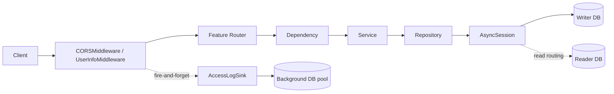
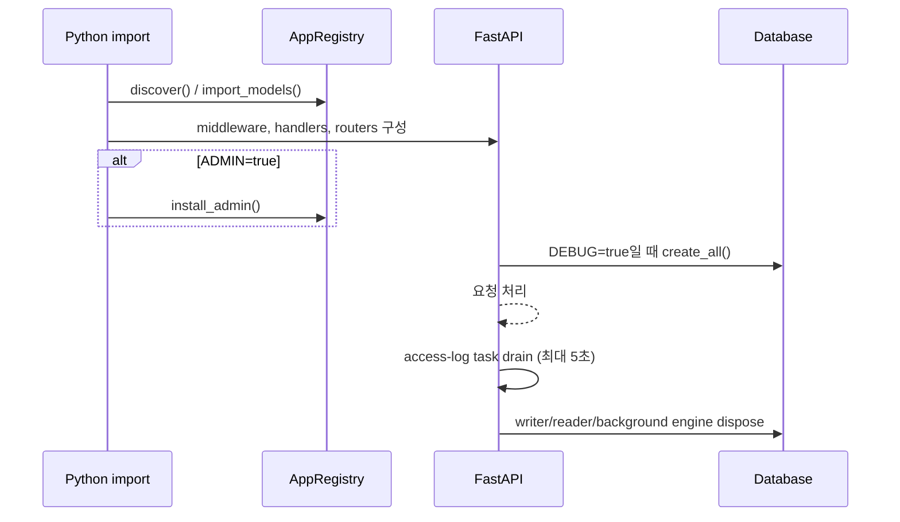

<!-- generated-by: gsd-doc-writer -->
# 시스템 설계

| 항목 | 값 |
|---|---|
| 프로젝트 | `fastapi-project-structure-django-active-style` |
| 문서 버전 | `v1.0.0` |
| 작성일 | `2026-08-18` |
| 기준 커밋 | `76aed3c1aea2d3f1754f650ba631c8d853562cec` |
| 상태 | 현재 구현 기준 |

## 개요

이 프로젝트는 FastAPI의 명시적 의존성 주입과 SQLAlchemy 비동기 세션을 유지하면서, Django의 앱 단위 구성과 자동 발견 방식을 적용한 참조 구조다. 기능은 `app/features/<name>/` 안에서 API, 모델, 스키마, 서비스, 저장소, 의존성, Admin을 함께 소유한다.

## 상위 구조

## 계층과 책임

| 계층 | 책임 | 대표 위치 |
|---|---|---|
| 조립 | 설정, lifespan, 미들웨어, 예외, 라우터와 Admin 결선 | `main.py` |
| 앱 레지스트리 | 기능 앱 발견, 라우터·모델·Admin 계약 검증 | `app/core/registry.py` |
| API | HTTP 입력, 응답 모델, 상태 코드, 커밋 시점 | `app/features/*/api/routers/` |
| 의존성 | 세션 성격에 맞는 서비스 구성, 현재 사용자 해석 | `app/features/*/dependencies/` |
| 서비스 | 도메인 유스케이스, 저장소 조합 | `app/features/*/services/` |
| 저장소 | SQLAlchemy 조회·변경 연산 | `app/features/*/repositories/` |
| 모델·스키마 | DB 엔터티와 외부 데이터 계약 분리 | `models/`, `schemas/` |
| 플랫폼 | DB 라우팅, 미들웨어, 로깅, Celery | `app/core/`, `app/celery/`, `app/utils/` |

## 앱 자동 발견 설계

`AppRegistry.discover()`는 `app.features`의 직계 하위 패키지를 이름순으로 찾고, `_`로 시작하는 패키지는 제외한다. 발견된 패키지를 import해 빠르고 멱등적인 초기화 훅을 실행한다. 이후 동일한 발견 목록을 다음 결선에 재사용한다.

1. `<app>.models`를 import하여 `Base.metadata`를 채운다.
2. `<app>.api.routers.router`의 `<name>_router`를 `/api` 아래에 마운트한다.
3. `ADMIN=true`이면 `<app>.admin`의 `admin_views`를 SQLAdmin에 등록한다.

선택 모듈이 없으면 건너뛰지만, 모듈이 존재하면서 export 이름이나 타입이 틀리면 `AppContractError`로 기동을 중단한다. 이 fail-fast 정책은 기능이 조용히 누락되는 상태를 방지한다.

## 요청과 트랜잭션 경계

API 핸들러는 의존성에서 서비스를 받고, 서비스는 같은 `AsyncSession`을 저장소에 전달한다. 조회 핸들러는 읽기 전용 세션을 사용한다. 생성·수정·삭제 핸들러는 응답을 만들기 전에 `await service.commit()`을 호출한다. 커밋 실패가 성공 응답 뒤에 발생하지 않도록 커밋 책임을 yield 의존성 종료 단계에 두지 않는다.

전역 예외 처리기는 애플리케이션 예외, 입력 검증 오류, HTTP 오류, 미처리 오류를 공통 `ErrorResponse` 형태로 변환한다. 미처리 오류 상세는 `DEBUG=true`에서만 반환된다.

## 기동과 종료 경계

운영(`DEBUG=false`)에서는 테이블 자동 생성을 하지 않고 Alembic을 사용한다. `/docs`와 `/openapi.json`도 DEBUG 모드에서만 노출된다. `/health`는 프로세스 응답 상태와 앱 버전을 제공하며 DB 준비 상태를 검사하지 않는다.

## 데이터 설계

- `Base`, `TimestampMixin`, `UUIDMixin`이 공통 모델 기반을 제공한다.
- 요청용 writer 풀, 선택적 reader 풀, 접속 로그와 Celery용 background 풀이 분리된다.
- `DB_ROUTER_ENABLED=true`일 때 SELECT는 reader, DML과 flush는 writer를 사용한다.
- 한 세션은 하나의 reader에 고정되고, 쓰기 후에는 선택적으로 writer에 고정되어 read-after-write 일관성을 지킨다.
- `get_read_session()`은 라우터 활성 시 쓰기 시도를 `ReadOnlyRoutingError`로 차단한다.

## 보안 경계와 운영 주의

- JWT access/refresh 서명 키 기본값은 개발용이므로 배포 전에 서로 다른 강한 비밀값으로 교체해야 한다.
- `ADMIN=true`의 `/admin`에는 인증 백엔드가 없다. 기본값도 `true`이므로 운영·스테이징에서는 반드시 `ADMIN=false` 또는 신뢰 경계의 프록시 차단을 적용한다.
- 접속 로그 미들웨어는 `X-Forwarded-For`와 `X-Real-IP`를 직접 신뢰한다. 신뢰 가능한 프록시가 헤더를 덮어쓰는 배포 경계가 필요하다.
- 접속 로그에는 IP, User-Agent, referer, query string, 사용자·세션 식별자가 포함될 수 있어 접근 통제와 보존 정책이 필요하다.
- CORS 설정은 credential 허용과 wildcard origin의 동시 사용을 설정 검증에서 거부한다.

## 주요 인터페이스

| 인터페이스 | 역할 |
|---|---|
| `AppRegistry.discover()` | 앱 목록의 단일 출처 생성 |
| `AppRegistry.install_routers()` | 라우터 계약 검증과 마운트 |
| `get_session()` | 자동 라우팅 요청 세션 |
| `get_read_session()` | 조회 전용 세션 |
| `get_write_session()` | writer 고정 세션 |
| `background_session()` | 요청 밖 트랜잭션 컨텍스트 |
| `BaseService.commit()/rollback()` | 핸들러가 호출하는 트랜잭션 헬퍼 |
| `AccessLogSink.save()` | 코어 미들웨어와 저장 도메인의 경계 |

## 설계상 구분

현재 기능 저장소는 `BaseRepository` 기반이다. ORM/Raw 이중 저장소와 포트·어댑터 전환은 [별도 고도화 계획](../../orm-raw-repository/2026-08-13/requirements.md)이며 기준 커밋의 완료 기능으로 간주하지 않는다.

> **갱신(2026-08-20).** ORM/Raw **이중 저장소는 구현됐다** — `BaseRepository`(ORM)와 `RawRepositoryBase`(Raw)는 상속 관계 없이 공존한다. 다만 *런타임에 구현을 바꿔 끼우는* 포트·어댑터는 아니고, 기능이 작성 시점에 둘 중 하나를 고르는 구조다. 선택 기준은 [`../../guides/orm-raw-workflow.md`](../../guides/orm-raw-workflow.md) 를 본다.
