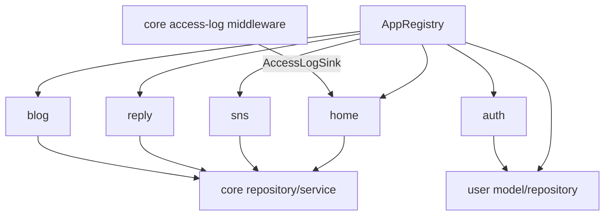

<!-- generated-by: gsd-doc-writer -->
# 기능 카탈로그

| 항목 | 값 |
|---|---|
| 프로젝트 | `fastapi-project-structure-django-active-style` |
| 문서 버전 | `v1.0.0` |
| 작성일 | `2026-08-18` |
| 기준 커밋 | `76aed3c1aea2d3f1754f650ba631c8d853562cec` |
| 상태 | 현재 구현 기준 |

## 개요

기준 커밋에는 6개의 자동 발견 기능 앱과 공통 플랫폼 기능이 있다. 공개 API는 `/health` 1개와 `/api/v1` 아래 도메인 경로 17개이며, 경로·메서드 조합은 `tests/test_route_inventory.py`가 회귀 검증한다.

## 도메인 기능

| 앱 | 주요 기능 | 모델 | 서비스 | 공개 경로 |
|---|---|---|---|---|
| `auth` | 회원가입, 로그인, 토큰 갱신, 현재 사용자 | User 모델 재사용 | `AuthService` | `/api/v1/auth/*` |
| `user` | 사용자 생성·목록·상세·수정·삭제 | `User` | `UserService` | `/api/v1/user/users*` |
| `blog` | 블로그 게시글 CRUD | `Post` | `BlogService` | `/api/v1/blog/posts*` |
| `reply` | 댓글 CRUD | `Reply` | `ReplyService` | `/api/v1/reply/replies*` |
| `sns` | SNS 게시물 CRUD | `SnsPost` | `SnsService` | `/api/v1/sns/posts*` |
| `home` | 접속 로그 조회·통계, 로그 저장 sink | `UserAccessLog` | `UserAccessLogService` | `/api/v1/home/access-logs*` |

## API 기능 요약

### Auth

| 메서드 | 경로 | 결과 |
|---|---|---|
| POST | `/api/v1/auth/register` | 사용자 생성, 201 |
| POST | `/api/v1/auth/login` | access/refresh 토큰 발급 |
| POST | `/api/v1/auth/refresh` | refresh 토큰 검증 후 토큰 재발급 |
| GET | `/api/v1/auth/me` | Bearer access 토큰의 현재 사용자 |

### User, Blog, Reply, SNS

각 도메인은 컬렉션 경로에 `GET/POST`, 식별자 경로에 `GET/PATCH/DELETE`를 제공한다. 생성은 201, 삭제는 204이며 목록은 `skip`과 `limit` 기반 페이지 조회를 사용한다.

### Home access log

- 전체 목록: `/api/v1/home/access-logs`
- 최근 로그: `/api/v1/home/access-logs/recent`
- IP별: `/api/v1/home/access-logs/by-ip/{ip_address}`
- 사용자별: `/api/v1/home/access-logs/by-user/{user_id}`
- 집계 통계: `/api/v1/home/access-logs/stats`

### Health와 API 문서

- `GET /health`: `status`, `version` 반환. DB readiness 검사는 하지 않는다.
- `GET /docs`, `/openapi.json`: `DEBUG=true`에서만 활성화된다.
- `/admin`: `ADMIN=true`에서만 SQLAdmin이 마운트한다.

## 플랫폼 기능

| 기능 | 구현 | 핵심 계약 |
|---|---|---|
| 앱 자동 발견 | `app/core/registry.py` | 이름순 발견, 계약 위반 시 fail-fast |
| DB 세션 | `app/core/db/session.py` | 요청·reader·background 풀 분리 |
| 읽기/쓰기 라우팅 | `app/core/db/router.py` | SELECT reader, DML writer, sticky/pinning |
| 글로벌 예외 | `main.py`, `app/core/exception.py` | 일관된 오류 응답 |
| CORS | `app/core/middlewares/cors_middleware.py` | 환경 설정 기반 허용 정책 |
| 접속 로그 | `UserInfoMiddleware`, `AccessLogSink` | 요청 비차단 저장, 상한과 종료 drain |
| Admin | `app/features/admin.py`, 앱별 `admin.py` | 설정 조건부 자동 뷰 등록 |
| 마이그레이션 | `migrations/env.py` | 런타임과 같은 AppRegistry 모델 목록 사용 |
| Celery | `app/celery/` | 중앙 앱·태스크, 프로세스별 영속 이벤트 루프 |
| 앱 생성기 | `scripts/new_app.py` | 컨벤션 구조 생성, 기본 덮어쓰기 거부 |

## 주요 데이터 항목

- `User`: 사용자명, 이메일, 비밀번호 해시, 활성 상태, 생성·수정 시각
- `Post`: 제목, 본문, 작성자, 생성·수정 시각
- `Reply`: 본문, 작성자, `post_id`, 생성·수정 시각
- `SnsPost`: 본문, 작성자, 좋아요 수, 생성·수정 시각
- `UserAccessLog`: IP·프록시 헤더, User-Agent 파생 정보, 요청·응답 정보, 사용자·세션 식별 정보

## 기능 간 관계

`auth`는 자격증명을 소유한 `user` 모델과 저장소를 사용한다. 코어 접속 로그 미들웨어는 `home`을 직접 import하지 않고 `AccessLogSink` 프로토콜을 통해 저장을 위임한다.

## 구현 상태와 제한

- User/Blog/Reply/SNS CRUD 경로에는 현재 `get_current_user` 의존성이 연결되어 있지 않다. 네트워크에 공개할 경우 별도 인가 정책이 필요하다.
- `/admin`은 인증 없는 개발 편의 기능이다. 운영에서는 비활성화가 필수다.
- 로그인에는 사용자 열거 타이밍 완화가 있지만 속도 제한, 계정 잠금, 토큰 폐기 목록은 구현되어 있지 않다.
- `/health`는 liveness 성격이며 DB, Redis, replica 상태를 검증하는 readiness가 아니다.
- ORM/Raw 저장소 선택 기능은 계획 단계이며 현재 기능 목록에 포함하지 않는다.

## 변경 영향 가이드

| 변경 | 함께 확인할 위치 |
|---|---|
| 공개 경로·메서드 | 라우터, OpenAPI operation ID, `tests/test_route_inventory.py` |
| 모델 필드 | 스키마, 저장소, Admin 노출, Alembic revision |
| 트랜잭션 | 핸들러의 명시적 commit, 서비스·저장소 테스트 |
| 신규 앱 | AppRegistry 계약, 모델 import, Admin, 생성기 테스트 |
| 인증 정책 | auth dependency, 보호 대상 라우터, 오류 응답, 보안 테스트 |
| 접속 로그 필드 | 미들웨어, sink, 모델·스키마, 개인정보 보존 정책 |
