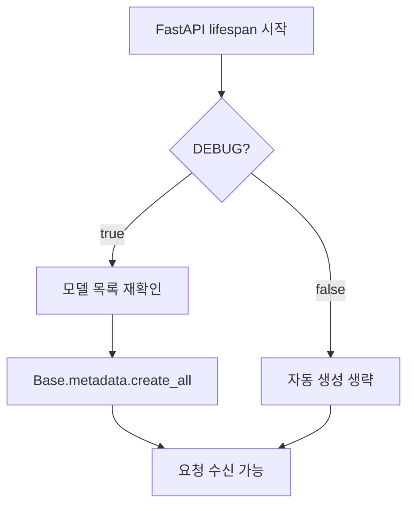
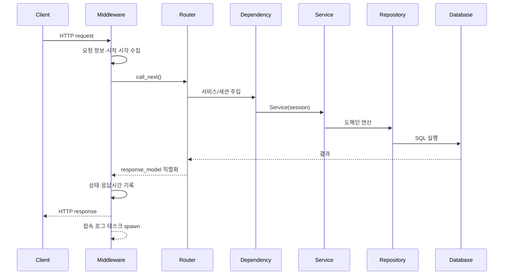

<!-- generated-by: gsd-doc-writer -->
# 전체 End-to-End 워크플로우

| 항목 | 값 |
|---|---|
| 프로젝트 | `fastapi-project-structure-django-active-style` |
| 문서 버전 | `v1.0.0` |
| 작성일 | `2026-08-18` |
| 기준 커밋 | `76aed3c1aea2d3f1754f650ba631c8d853562cec` |
| 상태 | 현재 구현 기준 |

## 개요

이 문서는 프로세스 import, 애플리케이션 기동, 요청 처리, 비동기 부수 작업, 정상 종료까지의 전체 흐름을 설명한다.

## 1. Import와 애플리케이션 조립

1. `main.py`가 설정, DB 엔진과 `AppRegistry`를 import한다.
2. `registry.discover()`가 기능 앱을 이름순으로 발견하고 패키지를 import한다.
3. `home` 패키지 초기화가 `HomeAccessLogSink`를 코어 sink registry에 등록한다.
4. `registry.import_models()`가 발견 앱의 모델을 `Base.metadata`에 등록한다.
5. FastAPI 인스턴스를 만들고 CORS·접속 로그 미들웨어와 4종 글로벌 예외 처리기를 등록한다.
6. `registry.install_routers()`가 각 `<name>_router`를 `/api` 아래에 마운트한다.
7. `/health`와 DEBUG 조건부 `/docs`를 추가한다.
8. `ADMIN=true`이면 SQLAdmin을 만들고 앱별 `admin_views`를 등록한다.

잘못된 라우터·Admin export나 중복 객체는 조립 단계에서 `AppContractError`를 발생시킨다.

## 2. Lifespan 시작

`DEBUG=false`에서는 스키마가 준비됐는지 기동 중 확인하지 않는다. 배포 파이프라인이 Alembic 적용을 보장해야 한다.

## 3. 공통 HTTP 요청

입력은 Pydantic 스키마로 검증된다. 검증 실패는 공통 오류 응답으로 바뀐다. `AppException` 계열은 정의된 상태 코드와 오류 코드를 사용하며, 알 수 없는 예외는 500으로 변환된다.

## 4. 조회 워크플로우

1. 라우터가 `get_<domain>_service_readonly` 또는 읽기 전용 의존성을 요청한다.
2. `get_read_session()`이 세션을 생성하고 라우터 활성 시 read-only 표시를 한다.
3. 저장소 SELECT는 replica가 있으면 세션별로 고정된 reader, 없으면 writer로 간다.
4. 서비스가 응답 스키마에 필요한 모델을 반환한다.
5. 세션은 커밋 없이 닫힌다. 오류가 발생하면 롤백한다.

## 5. 쓰기 워크플로우

1. 라우터가 일반 쓰기 서비스를 주입받는다.
2. 서비스가 유효성·중복·존재 여부를 검사하고 저장소에 변경을 요청한다.
3. DML 또는 flush가 writer를 선택하고 같은 세션의 이후 조회도 writer에 고정한다.
4. 라우터 본문이 `await service.commit()`을 호출한다.
5. 커밋이 성공한 뒤에만 성공 응답을 생성한다. 삭제는 204를 반환한다.
6. 예외 시 세션 의존성이 롤백하고 전역 처리기가 오류 응답을 만든다.

## 6. 접속 로그 부수 흐름

응답 생성 후 미들웨어는 로그 저장 코루틴을 `BackgroundTaskRunner`에 넘긴다. 활성 태스크가 256개 이상이면 요청을 기다리게 하지 않고 해당 로그를 버리며 누적 드롭 수를 기록한다. 수락된 작업은 home sink와 별도 background DB 풀을 사용해 저장하고 명시적으로 커밋한다. 저장 실패는 애플리케이션 응답에 영향을 주지 않고 로그로만 남는다.

## 7. 인증 요청의 변형

`/auth/me`는 Bearer access 토큰을 검증하고 read-only 세션에서 활성 사용자를 조회한다. 로그인과 refresh는 토큰을 발급하지만 DB 커밋은 필요하지 않는다. 회원가입만 사용자 저장 후 핸들러 본문에서 커밋한다.

## 8. 정상 종료

1. lifespan이 새 요청 처리를 종료한다.
2. `access_log_tasks.drain()`이 진행 중인 로그 작업을 최대 5초 기다린다.
3. writer engine을 dispose한다.
4. 모든 reader engine을 dispose한다.
5. background engine을 dispose한다.

drain 제한 시간이 끝났을 때 미완료 작업을 강제로 취소하지는 않으며 경고를 기록한다. 따라서 종료 직전 비핵심 접속 로그가 유실될 수 있다.

## 실패 지점과 관찰 포인트

| 지점 | 외부 결과 | 확인 위치 |
|---|---|---|
| 앱 계약 위반 | 프로세스 기동 실패 | registry 로그, `AppContractError` |
| DEBUG 테이블 생성 실패 | 기동 실패 | startup/database 로그 |
| 입력 검증 실패 | 구조화된 422 응답 | validation 로그 |
| 도메인 예외 | 정의된 4xx/5xx 응답 | error code와 도메인 로그 |
| DB 커밋 실패 | 성공 응답 전 오류 | session rollback 로그 |
| 접속 로그 포화 | 본 요청 성공, 로그 드롭 | background task warning과 `dropped` |
| 엔진 종료 경합 | 종료 경고, 일부 로그 유실 가능 | drain timeout 로그 |

## 운영 체크리스트

- 운영은 `DEBUG=false`, `ADMIN=false`를 명시한다.
- Alembic 업그레이드를 서버 트래픽 전환 전에 완료한다.
- JWT 두 서명 키를 개발 기본값에서 교체한다.
- `/health`만으로 DB·Redis readiness를 판단하지 않는다.
- 접속 로그 드롭 수와 DB 풀 대기 시간을 별도 지표로 노출하는 것을 권장한다.
