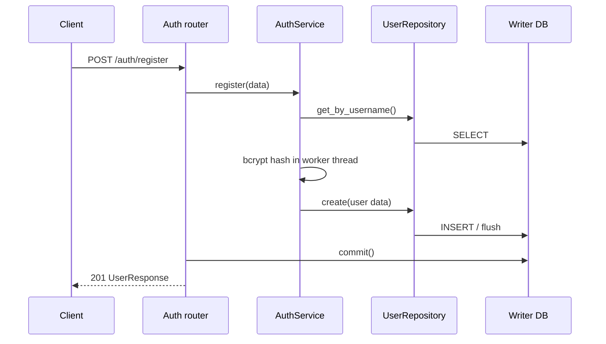

<!-- generated-by: gsd-doc-writer -->
# 인증·사용자 워크플로우

| 항목 | 값 |
|---|---|
| 프로젝트 | `fastapi-project-structure-django-active-style` |
| 문서 버전 | `v1.0.0` |
| 작성일 | `2026-08-18` |
| 기준 커밋 | `76aed3c1aea2d3f1754f650ba631c8d853562cec` |
| 상태 | 현재 구현 기준 |

## 개요

`auth` 앱은 인증 유스케이스를 소유하고 `user` 앱의 `User` 모델과 `UserRepository`를 재사용한다. access/refresh JWT는 서로 다른 설정 키를 사용하며, 현재 사용자 확인에는 access 토큰만 허용한다.

## API 계약

| 메서드 | 경로 | 입력 | 응답·상태 |
|---|---|---|---|
| POST | `/api/v1/auth/register` | `RegisterRequest` | `UserResponse`, 201 |
| POST | `/api/v1/auth/login` | OAuth2 form username/password | `TokenResponse`, 200 |
| POST | `/api/v1/auth/refresh` | refresh 토큰 | `TokenResponse`, 200 |
| GET | `/api/v1/auth/me` | Bearer access 토큰 | `UserResponse`, 200 |
| POST | `/api/v1/user/users` | `UserCreate` | `UserResponse`, 201 |
| GET | `/api/v1/user/users` | `skip`, `limit` | `UserListResponse`, 200 |
| GET | `/api/v1/user/users/{user_id}` | 경로 ID | `UserResponse`, 200 |
| PATCH | `/api/v1/user/users/{user_id}` | `UserUpdate` | `UserResponse`, 200 |
| DELETE | `/api/v1/user/users/{user_id}` | 경로 ID | 본문 없음, 204 |

## 회원가입

사용자명이 이미 있으면 409 도메인 예외를 반환한다. bcrypt 계산은 `asyncio.to_thread()`로 이벤트 루프 밖에서 실행한다. 응답 스키마에는 비밀번호와 해시가 포함되지 않는다.

## 로그인과 토큰 발급

1. OAuth2 password form에서 사용자명과 비밀번호를 받는다.
2. 사용자명으로 사용자를 조회한다.
3. 사용자가 없거나 해시가 없어도 더미 bcrypt 해시를 검증해 응답 시간 차이를 줄인다.
4. 비밀번호, 활성 상태를 함께 확인한다.
5. 성공 시 사용자 ID를 subject로 access 토큰과 refresh 토큰을 발급한다.

비활성 사용자, 미존재 사용자, 잘못된 비밀번호는 동일한 인증 실패 경로를 사용한다. 이는 사용자명 열거 완화에 도움이 되지만 네트워크 변동까지 포함한 완전한 시간 동일성을 보장하지는 않는다.

## Refresh

refresh 엔드포인트는 토큰 종류와 서명을 검증하고 subject로 사용자를 조회한 뒤 새 토큰 쌍을 발급한다. access 키와 refresh 키를 분리해 한쪽 키 노출의 영향을 제한한다. 서버 측 토큰 저장소나 폐기 목록은 없으므로 발급한 JWT를 개별 철회하는 기능은 없다.

## 현재 사용자 확인

`OAuth2PasswordBearer`가 `/api/v1/auth/login`을 토큰 URL로 선언한다. `get_current_user()`는 다음 순서로 처리한다.

1. Authorization 헤더에서 Bearer 토큰을 추출한다.
2. access 토큰 타입과 서명을 검증한다.
3. `sub` 사용자 ID를 읽는다.
4. read-only 세션으로 사용자를 조회한다.
5. 사용자가 존재하고 활성 상태일 때만 반환한다.

인증 조회 세션과 쓰기 라우트의 세션은 분리될 수 있다. 인증에서 얻은 ORM 객체를 쓰기 세션에서 직접 수정하지 말고, 쓰기 세션으로 다시 조회해야 한다.

## 사용자 CRUD

- 생성·수정·삭제는 `UserService`가 `UserRepository`를 호출하고 라우터가 응답 전 커밋한다.
- 목록·상세는 read-only 서비스를 사용하고 커밋하지 않는다.
- 사용자명 전용 조회는 `UserRepository.get_by_username()`이 제공한다.
- `User`는 UUID 기반 ID, unique/index 사용자명, 이메일, nullable 비밀번호 해시, 활성 상태와 timestamp를 가진다.

## 보안 검수 결과

| 항목 | 현재 상태 | 필요한 운영 조치 |
|---|---|---|
| JWT 키 | 개발 기본 문자열 제공 | 배포 시 강한 임의값으로 두 키 모두 교체 |
| 비밀번호 | bcrypt 해시, 스레드 격리 | 비용 계수와 처리량 모니터링 |
| 사용자 열거 | 더미 해시로 시간차 완화 | 로그인 rate limit·경보 추가 권장 |
| 토큰 폐기 | 없음 | 필요 시 jti/denylist 또는 키 회전 정책 추가 |
| User CRUD 인가 | 현재 보호 의존성 없음 | 외부 공개 전 역할·소유권 인가 연결 |
| Admin | 인증 없음, 기본 활성 | 운영 `ADMIN=false` 필수 |
| 해시 노출 | API 응답 제외, Admin 컬럼 제외 설정 | Admin 설정 회귀 테스트 유지 |

## 주요 구현 위치

- `app/features/auth/api/routers/v1/auth.py`
- `app/features/auth/dependencies/auth_dependencies.py`
- `app/features/auth/services/auth_service.py`
- `app/utils/authenticator/auth.py`
- `app/features/user/models/models.py`
- `app/features/user/repositories/user_repository.py`
- `app/features/user/api/routers/v1/user.py`

## 테스트 포인트

- 정상·중복 회원가입과 커밋 실패가 201로 잘못 반환되지 않는지 확인한다.
- 미존재 사용자와 잘못된 비밀번호의 오류 응답이 동일한지 확인한다.
- access 토큰을 refresh 경로에, refresh 토큰을 `/me`에 사용했을 때 거부되는지 확인한다.
- 비활성 사용자와 만료·변조 토큰이 401인지 확인한다.
- 모든 사용자 API 응답과 OpenAPI 스키마에 `hashed_password`가 없는지 확인한다.
