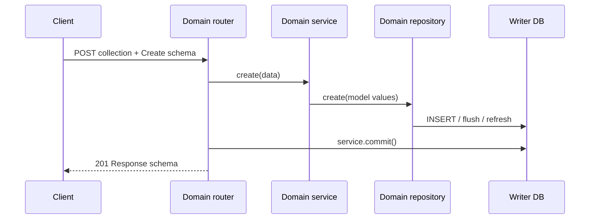

<!-- generated-by: gsd-doc-writer -->
# 콘텐츠 기능 워크플로우

| 항목 | 값 |
|---|---|
| 프로젝트 | `fastapi-project-structure-django-active-style` |
| 문서 버전 | `v1.0.0` |
| 작성일 | `2026-08-18` |
| 기준 커밋 | `76aed3c1aea2d3f1754f650ba631c8d853562cec` |
| 상태 | 현재 구현 기준 |

## 개요

Blog, Reply, SNS 앱은 동일한 Router → Dependency → Service → Repository → Model 패턴으로 CRUD를 제공한다. 구조는 같지만 각각 독립된 모델, 스키마, 서비스와 저장소를 소유한다.

## 경로 매핑

| 도메인 | 컬렉션 경로 | 항목 경로 |
|---|---|---|
| Blog | `/api/v1/blog/posts` | `/api/v1/blog/posts/{post_id}` |
| Reply | `/api/v1/reply/replies` | `/api/v1/reply/replies/{reply_id}` |
| SNS | `/api/v1/sns/posts` | `/api/v1/sns/posts/{post_id}` |

각 컬렉션 경로는 `POST`와 `GET`, 항목 경로는 `GET`, `PATCH`, `DELETE`를 제공한다.

## 모델과 주요 필드

| 도메인 | 모델·테이블 | 주요 필드 |
|---|---|---|
| Blog | `Post`, `blog_posts` | `id`, `title`, `content`, `author`, timestamps |
| Reply | `Reply`, `replies` | `id`, `content`, `author`, `post_id`, timestamps |
| SNS | `SnsPost`, `sns_posts` | `id`, `content`, `author`, `like_count`, timestamps |

현재 `author`는 인증된 `User` 관계에서 자동 설정되는 값이 아니라 요청 데이터 계약의 문자열 값이다. 콘텐츠 라우트에도 현재 사용자·소유권 인가가 연결되어 있지 않다.

## 생성

입력 검증 후 서비스가 저장소에 생성을 위임한다. ID와 timestamp처럼 DB/모델이 결정하는 값을 포함한 응답을 만들고, 라우터 본문에서 커밋한 다음 201을 반환한다.

## 목록과 상세 조회

목록은 `skip`과 `limit`을 받아 read-only 서비스로 조회한다. 저장소가 결과와 총 개수를 제공하고 목록 응답 스키마가 이를 감싼다. 상세는 ID로 단건 조회하며 없으면 도메인별 not-found 예외로 변환한다.

DB 라우터와 replica가 활성화되어 있으면 조회 세션은 한 reader에 고정된다. replica가 없거나 라우터가 꺼져 있으면 writer를 사용한다.

## 부분 수정

1. PATCH 스키마는 전달된 필드만 추출한다.
2. 서비스가 대상 존재 여부를 확인한다.
3. 저장소가 변경 필드를 모델에 적용하고 flush/refresh한다.
4. 라우터가 커밋한 뒤 갱신된 응답을 반환한다.

빈 PATCH의 허용 여부와 각 필드 제약은 도메인 스키마가 결정한다. 필드 추가 시 create/update/response 스키마의 노출 범위를 각각 검토해야 한다.

## 삭제

서비스가 대상을 찾고 저장소에 삭제를 요청한다. 라우터가 커밋을 완료한 뒤 응답 본문 없이 204를 반환한다. 존재하지 않는 ID는 성공으로 간주하는 멱등 삭제가 아니라 not-found 오류 경로를 따른다.

## Reply의 게시글 연결

`Reply.post_id`는 댓글이 어느 게시글을 대상으로 하는지 나타낸다. 이 기준 문서는 DB 수준 외래 키나 게시글 존재 검증을 보장하지 않는다. 댓글 생성 시 참조 무결성이 비즈니스 요구라면 모델 제약과 서비스 검증을 함께 추가하고, 삭제 정책(CASCADE/RESTRICT/soft delete)을 명시해야 한다.

## 공통 오류 흐름

| 상황 | 처리 |
|---|---|
| 스키마 검증 실패 | 전역 검증 처리기가 구조화된 422 반환 |
| 대상 없음 | 도메인 not-found 예외 반환 |
| DB flush/commit 실패 | 요청 세션 rollback 후 공통 오류 응답 |
| 알 수 없는 예외 | DEBUG에 따라 상세를 숨긴 500 |

## 보안·무결성 검수 결과

- CRUD 엔드포인트에는 인증과 소유권 검사가 없다. 공개 API라면 작성자 위조, 임의 수정·삭제가 가능하므로 배포 전에 정책을 연결해야 한다.
- 목록의 `limit` 상한은 각 라우터/스키마 구현을 유지해야 하며, 무제한 조회를 허용하지 않아야 한다.
- 본문 크기, HTML/링크 허용 정책과 출력 컨텍스트별 인코딩 책임을 명시적으로 결정해야 한다.
- Blog, Reply, SNS 간 참조 관계와 삭제 전파 정책은 현재 구조만으로 보장되지 않는다.
- Admin이 활성화되면 API 인가와 별개로 데이터 변경이 가능하므로 운영에서 비활성화해야 한다.

## 기능 추가 예시

새 콘텐츠 필드를 추가할 때 다음 순서로 변경한다.

1. 모델과 Alembic revision을 작성한다.
2. create/update/response 스키마별 허용 범위를 정한다.
3. 서비스의 도메인 규칙과 저장소 연산을 갱신한다.
4. Admin에서 민감 필드 노출 여부를 확인한다.
5. API·서비스·저장소 테스트와 route inventory를 실행한다.
6. 이 문서의 모델·워크플로우·보안 항목을 갱신한다.

## 주요 구현 위치

- `app/features/blog/`
- `app/features/reply/`
- `app/features/sns/`
- `app/core/repositories/repository_base.py`
- `app/core/services/services_base.py`
