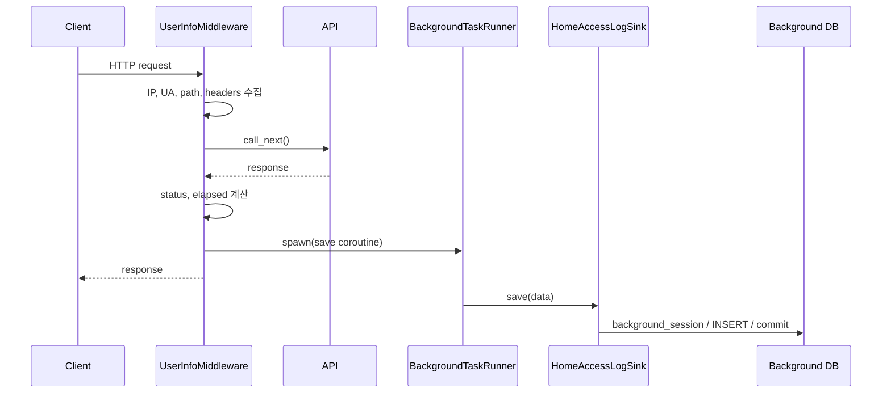

<!-- generated-by: gsd-doc-writer -->
# Home 접속 로그 워크플로우

| 항목 | 값 |
|---|---|
| 프로젝트 | `fastapi-project-structure-django-active-style` |
| 문서 버전 | `v1.0.0` |
| 작성일 | `2026-08-18` |
| 기준 커밋 | `76aed3c1aea2d3f1754f650ba631c8d853562cec` |
| 상태 | 현재 구현 기준 |

## 개요

접속 로그 기능은 코어의 `UserInfoMiddleware`가 요청 정보를 수집하고, home 앱이 `AccessLogSink` 구현으로 저장을 담당하는 구조다. 코어가 home 저장소를 직접 참조하지 않아 미들웨어와 도메인 저장 책임이 분리된다.

## 구성요소

| 구성요소 | 책임 |
|---|---|
| `UserInfoMiddleware` | 요청·응답 정보 수집, 저장 작업 제출 |
| `BackgroundTaskRunner` | 동시 작업 상한, 드롭 집계, 종료 drain |
| `AccessLogSink` | 저장 백엔드 프로토콜과 전역 등록 지점 |
| `HomeAccessLogSink` | background 세션으로 home 서비스 호출 |
| `UserAccessLogService` | 로그 생성, 목록·필터·통계 유스케이스 |
| `UserAccessLogRepository` | DB 저장과 IP·사용자·기간·통계 쿼리 |
| `UserAccessLog` | 접속 로그 영속 모델 |

## 초기 결선

`AppRegistry.discover()`가 home 패키지를 import하면 `home/__init__.py`가 `register_sink()`를 실행한다. 이 초기화는 FastAPI 미들웨어가 요청을 받기 전에 끝난다. sink가 등록되지 않은 경우 미들웨어는 저장을 생략한다.

## 요청 수집과 저장

수집 제외 경로와 확장자는 `ACCESS_LOG_EXCLUDE_PATHS`, `ACCESS_LOG_EXCLUDE_EXTENSIONS` 설정을 따른다. `ACCESS_LOG_ENABLED=false`이면 전체 수집을 생략한다.

## 수집 항목

- 네트워크: client IP, `X-Forwarded-For`, `X-Real-IP`
- User-Agent 원문과 OS, 브라우저, 장치 유형·브랜드·모델, bot 여부
- 요청: path, method, query string, referer, accept-language
- 응답: status code, 처리 시간(ms)
- 식별: `session_id` 쿠키, `request.state.user_id`가 있으면 사용자 ID

현재 인증은 JWT 기반이며 이 미들웨어가 Bearer 토큰을 직접 해석하지 않는다. 다른 구성요소가 `request.state.user_id`를 설정하지 않으면 사용자 ID는 비어 있을 수 있다.

## 클라이언트 IP 판정

우선순위는 `X-Forwarded-For`의 첫 값 → `X-Real-IP` → 직접 연결 주소 → `unknown`이다. 헤더를 보낸 프록시의 신뢰 여부를 애플리케이션에서 검증하지 않으므로, 인터넷 클라이언트가 직접 접근 가능한 배포에서는 IP 위조가 가능하다.

운영에서는 신뢰 가능한 리버스 프록시만 애플리케이션에 연결하고, 프록시가 외부의 전달 헤더를 제거한 뒤 새 값으로 설정해야 한다. 보안 판정·차단·감사 증거를 이 값 하나에 의존해서는 안 된다.

## 백프레셔와 장애 격리

- 동시 접속 로그 작업 상한은 256개다.
- 상한 도달 시 새 로그는 버리고 `dropped`를 증가시킨다.
- 로그 저장 실패는 오류 로그를 남기지만 원래 HTTP 응답을 실패시키지 않는다.
- background 풀은 요청용 DB 풀과 분리되어 비핵심 로그 적재가 API 풀을 고갈시키는 영향을 줄인다.
- 종료 시 최대 5초 drain하고, 제한 시간 뒤 남은 작업은 경고한다.

이 설계는 API 가용성을 로그 완전성보다 우선한다. 규제 또는 보안 감사상 무손실 로그가 필요하면 durable queue와 재처리·중복 제거 설계가 필요하다.

## 조회 API

| 메서드 | 경로 | 용도 |
|---|---|---|
| GET | `/api/v1/home/access-logs` | 페이지 목록 |
| GET | `/api/v1/home/access-logs/recent` | 최근 로그 |
| GET | `/api/v1/home/access-logs/by-ip/{ip_address}` | IP별 조회 |
| GET | `/api/v1/home/access-logs/by-user/{user_id}` | 사용자별 조회 |
| GET | `/api/v1/home/access-logs/stats` | 장치·OS·브라우저 등 집계 |

조회는 read-only 세션을 사용한다. 현재 라우트에는 인증·관리자 인가가 연결되어 있지 않아 외부에 공개하면 개인정보와 활동 정보가 노출될 수 있다.

## 개인정보·보안 체크리스트

- 접속 로그 조회 API에 관리자 인증과 최소 권한을 적용한다.
- query string과 referer에 토큰·이메일 등 비밀값이 들어오지 않도록 redaction을 추가한다.
- IP, 세션 ID, 사용자 ID의 수집 목적·보존 기간·파기 절차를 정한다.
- 데이터 내보내기와 Admin 노출을 별도로 통제한다.
- 드롭 수, 저장 실패 수, drain timeout을 모니터링한다.
- 삭제·익명화 요청을 처리할 인덱스와 운영 절차를 준비한다.

## 테스트 포인트

- 제외 경로·확장자와 비활성 설정이 저장 작업을 만들지 않는지 확인한다.
- 동시 작업 상한에서 코루틴이 닫히고 드롭 수가 정확한지 확인한다.
- 저장 실패가 원래 응답을 변경하지 않는지 확인한다.
- shutdown이 dispose보다 먼저 drain하는지 확인한다.
- 전달 헤더 우선순위와 User-Agent 파싱의 빈 값 처리를 확인한다.
