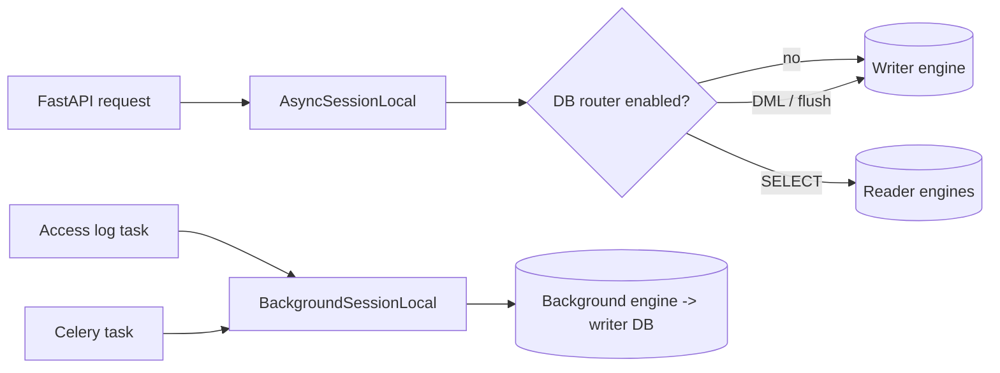
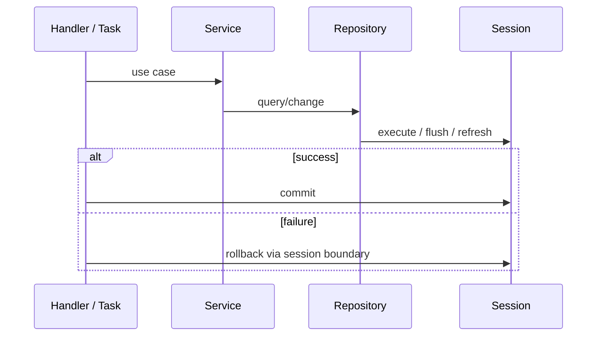

<!-- generated-by: gsd-doc-writer -->
# 데이터·런타임 워크플로우

| 항목 | 값 |
|---|---|
| 프로젝트 | `fastapi-project-structure-django-active-style` |
| 문서 버전 | `v1.0.0` |
| 작성일 | `2026-08-18` |
| 기준 커밋 | `76aed3c1aea2d3f1754f650ba631c8d853562cec` |
| 상태 | 현재 구현 기준 |

## 개요

데이터 계층은 SQLAlchemy async engine/session을 사용하며, 요청 writer, 선택적 replica reader, 요청 밖 background 풀을 분리한다. FastAPI 요청과 Celery 작업은 서로 다른 진입점이지만 서비스·저장소와 background 트랜잭션 컨텍스트를 공유한다.

## 엔진 토폴로지

| 엔진 | 용도 | 기본 풀 설정 |
|---|---|---|
| `engine` / `writer_engine` | API primary와 SQLAdmin | pool 20 + overflow 20 |
| `read_engines` | replica SELECT | replica마다 pool 20 + overflow 20 |
| `background_engine` | 접속 로그·Celery 쓰기 | pool 10 + overflow 10 |

replica 수만큼 전체 연결 상한이 증가한다. DB 서버의 연결 제한과 워커 프로세스 수를 함께 계산해야 한다.

## 세션 인터페이스

| 인터페이스 | 선택 규칙 | 사용 위치 |
|---|---|---|
| `get_session()` | 자동 reader/writer 라우팅 | 일반 요청·쓰기 서비스 |
| `get_read_session()` | reader 고정, 라우터 활성 시 쓰기 차단 | 목록·상세·인증 조회 |
| `get_write_session()` | 첫 구문부터 writer 고정 | 강한 일관성이 필요한 쓰기 흐름 |
| `background_session()` | 별도 writer 풀, 예외 시 rollback | sink·Celery 권장 방식 |
| `get_background_session()` | generator 형식 background 세션 | 호환용 요청 밖 작업 |

세션 컨텍스트는 예외 시 롤백하지만 성공 시 자동 커밋하지 않는다. 요청 라우터 또는 background 작업이 커밋 시점을 명시한다.

## 읽기/쓰기 라우팅

`DB_ROUTER_ENABLED=false`가 기본이며 모든 작업은 writer로 간다. 활성화하면 다음 규칙을 적용한다.

1. ORM flush나 Core INSERT/UPDATE/DELETE는 writer를 사용한다.
2. 그 밖의 SELECT는 reader 목록에서 라운드로빈으로 고른다.
3. 한 세션이 선택한 reader는 세션 종료까지 유지된다.
4. 쓰기 후 `DB_READ_STICKY_AFTER_WRITE=true`이면 같은 세션의 이후 조회는 writer에 고정된다.
5. reader가 없으면 조회도 writer로 fallback한다.

`DB_REPLICATION_ENABLED=true`는 router 활성과 하나 이상의 replica host를 요구하며, 설정 검증이 잘못된 조합을 거부한다. 복제 지연을 허용할 수 없는 조회에는 `using_writer(session)`을 사용한다.

## 저장소·서비스 트랜잭션

`BaseService`는 session을 보유하고 `commit()`·`rollback()` 헬퍼를 제공한다.

> **갱신(2026-08-20).** 이 문단은 작성 시점(2026-08-18) 기준이었다. 이후 ORM 과 독립된 Raw 계층이 추가되어 현재는 **두 계열이 모두 존재**한다 — ORM 은 `BaseRepository`, Raw 는 `RawRepositoryBase` 이며 상속 관계가 없다. 다만 이는 *런타임에 구현을 바꿔 끼우는* 포트·어댑터가 아니라, 기능이 작성 시점에 둘 중 하나를 고르는 구조다. 선택 기준과 각 워크플로는 [`../../guides/orm-raw-workflow.md`](../../guides/orm-raw-workflow.md) 를 본다. 예제는 `app/features/catalog/`(ORM)와 `app/features/reports/`(Raw)다.

## 모델 등록과 마이그레이션

런타임과 `migrations/env.py` 모두 `AppRegistry`로 기능 모델을 import한다. Alembic `target_metadata`는 공통 `Base.metadata`다. 설정의 `ALEMBIC_DATABASE_URL` 오버라이드가 있으면 우선하며, 아니면 writer DSN을 동기 드라이버용 URL로 변환한다.

개발 `DEBUG=true`에서는 lifespan이 `create_all()`을 실행한다. 운영은 다음 순서를 사용한다.

1. revision의 upgrade/downgrade와 데이터 변환을 검토한다.
2. 백업·롤백 기준을 확정한다.
3. `alembic upgrade head`를 적용한다.
4. 단일 head와 스키마 호환성을 확인한다.
5. 애플리케이션 트래픽을 전환한다.

`create_all()`은 migration 이력을 대체하지 않으며 기존 컬럼 변경·삭제를 수행하지 않는다.

## Celery 워크플로우

`app/celery/app.py`가 Redis broker/backend를 사용하는 중앙 Celery 앱을 만든다. 도메인 태스크는 `app/celery/tasks.py`에 모인다. 현재 예시 `home.aggregate_access_stats`는 background 세션으로 접속 로그 통계를 읽는다.

Celery 함수는 동기 실행 문맥이므로 `run_async()`가 프로세스별 하나의 영속 이벤트 루프에서 코루틴을 실행한다. 매 작업마다 `asyncio.run()`으로 루프를 닫지 않아 async DB 풀의 연결이 닫힌 루프에 묶이는 문제를 피한다. 이 전제는 기본 prefork 프로세스에서 태스크가 순차 실행되는 모델에 맞춰져 있으며, 다른 concurrency pool을 도입하면 재검증해야 한다.

## 기동·종료 런타임

- 기동: 앱 발견과 모델 import는 module import 시 수행된다.
- lifespan startup: DEBUG 조건부 테이블 생성.
- 실행: 요청 세션은 컨텍스트 종료 시 닫히며, 접속 로그는 background runner가 추적한다.
- 종료: 접속 로그 drain → writer/reader/background engine dispose 순서다.

Celery worker의 이벤트 루프와 엔진 정리는 FastAPI lifespan의 관리 대상이 아니다. 워커 종료 signal과 DB engine 정리 정책이 필요하면 별도로 구현해야 한다.

## 운영·보안 체크리스트

- writer, replica, background DB 계정을 최소 권한으로 분리할 수 있는지 검토한다.
- DSN과 비밀번호가 로그에 원문으로 노출되지 않도록 `describe_routing()`의 마스킹을 유지한다.
- replica 지연, reader 오류와 writer fallback 정책을 모니터링한다.
- pool 크기 × 프로세스 수 × replica 수로 최대 연결을 산정한다.
- Redis 접근 통제, TLS, 결과 보존과 task payload의 민감정보 여부를 검토한다.
- DB migration과 앱 배포의 순서를 하위 호환 방식으로 설계한다.
- `/health`가 데이터 의존성 readiness를 보장하지 않는다는 점을 오케스트레이터 설정에 반영한다.

## 관련 계획 문서

- [ORM/Raw 요구사항](../../orm-raw-repository/2026-08-13/requirements.md)
- [ORM/Raw 개발 계획](../../orm-raw-repository/2026-08-13/development-plan.md)
- [ORM/Raw 워크플로우 계획](../../orm-raw-repository/2026-08-13/workflow-guide.md)

위 문서는 후속 설계이며 현재 `BaseRepository` 구현보다 우선하는 실행 계약이 아니다.
